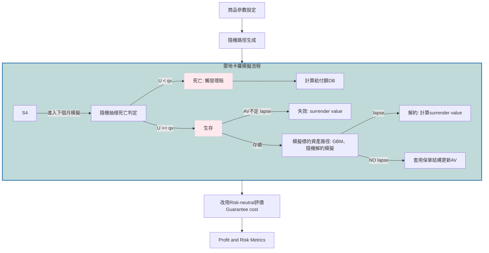

📘 投資型保單 GMDB 模擬與解約行為分析

Unit-Linked Insurance Simulation with GMDB and Dynamic Lapse Behavior

📌 專案簡介

本專案建立投資型保單（Unit-Linked Insurance）的 Monte Carlo Simulation 模型，參考實際商品設計，分析保戶解約行為（lapse behavior）對死亡給付、死亡成本與公司獲利的影響。

模型結合三個重要元素:

1. 使用 GBM 模擬投資標的報酬路徑，透過 Monte Carlo 生成帳戶價值（AV）的分布。
2. 參考實際商品保單結構、死亡率與 COI 費率，計算 Death Benefit 與 Death Cost 。
3. 引入動態解約模型（dynamic lapse model），使保戶行為隨帳戶價值、保證水準與市場環境變動。

------

🎯 目標 : 利用 paired Monte Carlo simulation 設計，在相同市場路徑與死亡隨機數下比較 No Lapse vs With Lapse
分析：
1. Account Value（AV）
2. Death Benefit（DB）
3. Death Cost（DC）
4. PV Profit（NPV）
5. 拆解利潤來源與 tail risk

----------

#### 💻 核心程式碼 完整模擬過程與數據分析請參考： [GMDB 定價模型主程式 (Jupyter Notebook)](./Simulation.ipynb)
---

## 🎯 Objectives

- 比較不同 GMDB 設計（Basic / Ratchet / Roll-up）
- 分析關鍵指標：
  - Account Value (AV)
  - Death Benefit (DB)
  - Guarantee Cost (GC)
  - Tail Risk
  - Profit Distribution
- 評估產品設計對風險與經濟成本的影響
- 使用 risk-neutral 方法衡量保證的市場一致價值

---

## 🧩 Model Framework

### Simulation Flow

🧠 模型架構
🔹 Monte Carlo + GBM
模擬投資標的隨機路徑 → 產生 AV 分布
🔹 GMDB 設計
DB = max(保證金額, 帳戶價值)
🔹 Death Cost（核心風險）
Death Cost = max(DB - AV, 0)

👉 代表公司實際承擔的保證損失

🔹 Paired Simulation（關鍵設計）
同一保戶
同一市場路徑
同一死亡亂數

👉 只改「是否解約」

📊 模擬結果
📈 AV 路徑比較（Conditional vs Unconditional）

圖說：
Unconditional AV 會受到死亡與解約（補 0）影響而下降；
Conditional AV 僅計算仍在池中的保戶，因此較高。

💰 Death Benefit vs Death Cost

圖說：
with lapse 下 DB 的右尾明顯下降，但 Death Cost 的尾端幾乎不變，
表示解約減少高 AV 給付，但未降低真正的保證風險。

📉 Profit 分布（Log Scale）

圖說：
with lapse 平均 profit 略為右移，但左尾（虧損區）幾乎重疊，
顯示 tail risk 並未改善。

⚠️ Tail Risk（Left Tail）

圖說：
最壞情境（極端虧損）在兩種情境下幾乎相同，
代表 lapse 無法消除 joint tail event（市場下跌 + 死亡）。

🔍 Profit vs Death Cost（關鍵圖）

圖說：

多數保戶（左側）無 death cost → 穩定獲利
少數右下角點 → 高 death cost + 大幅虧損
👉 tail risk 來源非常集中
🧩 Outcome Decomposition

將保戶分為三類：

類型	說明	對 Profit 影響
Same outcome	無差異	無影響
Survivor lapsed	提前解約	小幅下降
Death avoided by lapse	避開死亡	大幅提升

📊 視覺化：

圖說：
平均 profit 的提升來自少數「避免死亡」的案例，而非整體改善。

🔥 核心發現
1️⃣ Lapse 的雙重效果
Fee 收入 ↓
Risk 暴露 ↓
2️⃣ 平均 vs Tail
平均 Profit ↑
Tail Risk ≈ 不變

👉 關鍵原因：

Lapse reduces frequency, not severity
3️⃣ 風險來源

GMDB 的主要風險來自：

市場大跌 + 發生死亡（Joint Tail Event）
4️⃣ 商品設計含意
Lapse 是「風險釋放機制」
不是「風險解決機制」

👉 Tail risk 仍需：

保證設計
費率調整
Hedging
⚠️ 模型限制
單一資產（GBM）/ 年限 20 年
無 stochastic interest rate
無 hedging cost
lapse 未校準

